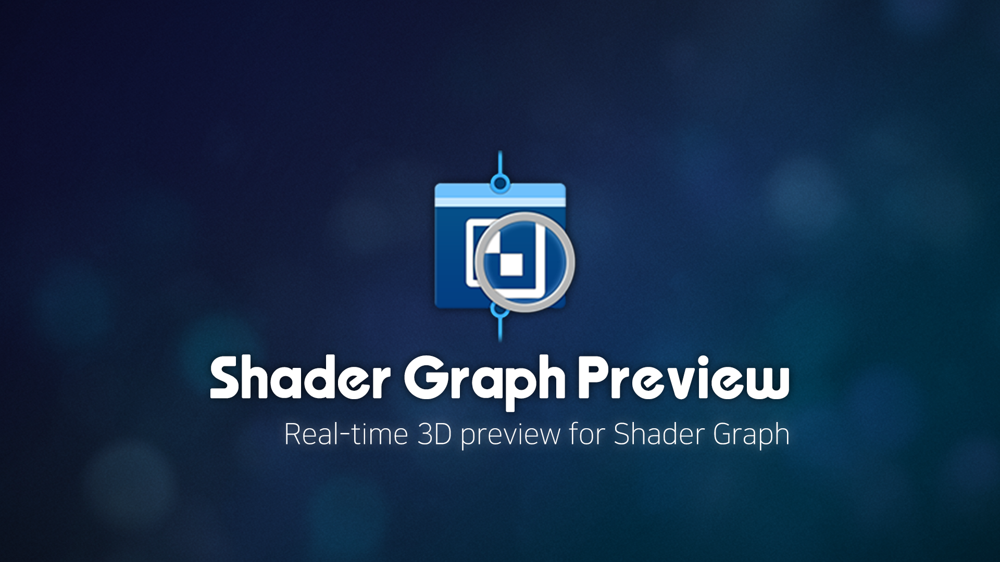
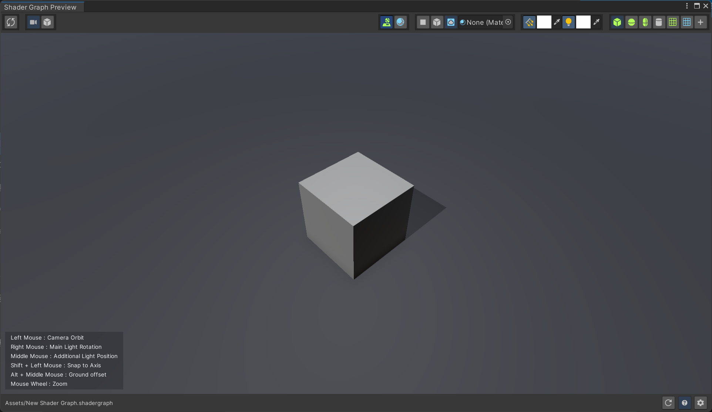

# Shader Graph Preview

---

© 2026 **INDiEA Games**. All rights reserved.

---

## Introduction

**An editor extension that adds a full 3D preview for Unity Shader Graph** — inspect shaders with lighting, camera, mesh, and environment in a dedicated window, without leaving your graph workflow.

---

## Why Shader Graph Preview?

If Shader Graph is a core part of your workflow, **Unity’s built-in Main Preview often isn’t enough to judge the final look**. The small sphere thumbnail is fine for quick smoke tests, but it breaks down when you care about gameplay-like context: lighting, camera distance, mesh silhouette, and how the shader reads against a background.

That pushes people into a **slow, repetitive loop**: spin up a test scene, place objects, pick a mesh, create a material, wire the graph, then hop into Play Mode or fight the Scene view camera. Do it often enough and your attention fragments—it stops feeling like you’re tuning a **shader** and starts feeling like you’re debugging a **workflow**.

**Shader Graph Preview** collapses that loop into **one dedicated 3D preview window in the editor**. It stays anchored to the active Shader Graph and keeps docking, toolbar, and settings in one place so you spend less time **building throwaway setups** and more time **validating the shader you actually care about**.

---

## Overview

| Item          | Details                                                                          |
| ------------- | -------------------------------------------------------------------------------- |
| Name          | INDiEA Shader Graph Preview                                                      |
| Version       | `0.2.0`                                                                          |
| Unity         | **2021.3** LTS or newer                                                          |
| Target        | Projects using **Shader Graph** (options per **Built-in / URP / HDRP** pipeline) |

---

## Requirements

---

| Symbol | Meaning            |
| ------ | ------------------ |
| **O**  | Verified           |
| **X**  | Not verified       |
| **△**  | Partially verified |

---

| Version     | Built-In | URP | HDRP |
| ----------- | -------- | --- | ---- |
| 2021.3.0f1  | O        | O   | O    |
| 2021.3.45f2 | X        | O   | X    |
| 2022.3.0    | X        | O   | X    |
| 2022.3.4f1  | X        | O   | X    |
| 2022.3.23f1 | X        | O   | X    |
| 2022.3.62f2 | X        | O   | X    |
| 2022.3.62f3 | X        | O   | X    |
| 6000.0.23f1 | X        | O   | X    |
| 6000.3.13f1 | X        | O   | X    |

---

## Quick start

1. Use the **preview toggle** at the bottom-right of the Shader Graph editor to quickly open or close **Shader Graph Preview** beside the graph. Or use **Window** → **INDiEA** → **Shader Graph Preview** → **Open Shader Graph Preview**.
2. With the preview open, adjust **camera, lights, background, and mesh** via the **toolbar and viewport**.
3. To open **preview settings**, click **Settings** at the bottom of the preview window, or use **Window** → **INDiEA** → **Shader Graph Preview** → **Open Shader Graph Preview Settings**. **Bottom Settings** lets you tune and save **camera, lighting, environment, mesh, performance**, and other options for **your project**.

---

## Key features

- **Dedicated 3D preview window** — validate material, lighting, and camera in a separate editor window driven by the active Shader Graph.
- **Camera** — orbit and zoom (mouse wheel), perspective / orthographic; in orthographic mode, **Shift + left-drag** helps snap to axes.
- **Lighting** — main directional and additional point lights, color, intensity, shadows; **right mouse / middle button** for intuitive control.
- **Environment** — **Solid Color**, **Skybox**, and **Room** background modes.
- **Mesh** — **presets** (cylinder, quad, etc.) and **custom mesh** preview.
- **Realtime preview** — when enabled in settings, mirrors the Shader Graph to disk so edits can be reflected in the preview **close to real time** (behavior may vary by Shader Graph and Unity version).
- **Performance** — target **FPS**, **resolution scale**, and **stop-draw** when the graph isn’t selected to reduce editor load.

---

## Preview window UI

### 1) Top toolbar

#### Realtime preview

| #   | UI · default tooltip      | Description                                                                                      |
| --- | ------------------------- | ------------------------------------------------------------------------------------------------ |
| 1   | `Enable Realtime Preview` | Mirrors the graph to disk and refreshes the preview more often. Experimental; may increase load. |

#### Camera projection

| #   | Button                 | Description                                     |
| --- | ---------------------- | ----------------------------------------------- |
| 2   | `Camera: Perspective`  | Sets the camera to **perspective** projection.  |
| 3   | `Camera: Orthographic` | Sets the camera to **orthographic** projection. |

#### Ground · background

| #   | Button                                | Description                                                                         |
| --- | ------------------------------------- | ----------------------------------------------------------------------------------- |
| 4   | `Ground Plane`                        | Toggles the **ground plane** under the subject.                                     |
| 5   | `Override Shader For Background Mesh` | Toggles using the **same shader as the preview subject** on ground/background mesh. |
| 6   | `Background: Solid Color`             | Sets the background to **solid color** mode.                                        |
| 7   | `Background: Room`                    | Sets the background to **room** mode.                                               |
| 8   | `Background: Skybox`                  | Sets the background to **skybox** mode.                                             |
| 9   | `Background: Solid Color`             | Picks the **background color** in solid mode.                                       |
| 10  | `Background: Skybox Material`         | Assigns the **material** used in skybox mode.                                       |

#### Lights

| #   | Button                   | Description                                        |
| --- | ------------------------ | -------------------------------------------------- |
| 11  | `Main Light`             | Turns the **main directional light** on or off.    |
| 12  | `Main Light Color`       | Changes **color** when the main light is on.       |
| 13  | `Additional Light`       | Turns the **additional point light** on or off.    |
| 14  | `Additional Light Color` | Changes **color** when the additional light is on. |

#### Mesh presets

| #   | Button     | Description                                       |
| --- | ---------- | ------------------------------------------------- |
| 15  | `Cube`     | Sets the preview mesh to a **cube**.              |
| 16  | `Sphere`   | Sets the preview mesh to a **sphere**.            |
| 17  | `Capsule`  | Sets the preview mesh to a **capsule**.           |
| 18  | `Cylinder` | Sets the preview mesh to a **cylinder**.          |
| 19  | `Plane`    | Sets the preview mesh to a **plane**.             |
| 20  | `Quad`     | Sets the preview mesh to a **quad**.              |
| 21  | `Custom`   | Switches to custom mode using a **project mesh**. |
| 22  | `Mesh`     | Assigns the **Mesh** asset to use in custom mode. |

### 2) Center — 3D viewport

The full area below the toolbar is the **preview render**. Use the mouse to control camera, lights, and ground.

### 3) Navigation Guide

| #   | Button                                     | Description                                         |
| --- | ------------------------------------------ | --------------------------------------------------- |
| 1   | `Left Mouse : Camera Orbit`                | Camera Orbit with left mouse button.                |
| 2   | `Right Mouse : Main Light Rotation`        | Main Light Rotation with right mouse button.        |
| 3   | `Middle Mouse : Additional Light Position` | Additional Light Position with middle mouse button. |
| 4   | `Shift + Left Mouse : Snap to Axis`        | Snap to Axis with shift + left mouse button.        |
| 5   | `Alt + Middle Mouse : Ground offset`       | Ground offset with alt + middle mouse button.       |
| 6   | `Mouse Wheel : Zoom`                       | Zoom with mouse wheel.                              |

### 4) Bottom toolbar

| #   | Button             | Description                                                                                                |
| --- | ------------------ | ---------------------------------------------------------------------------------------------------------- |
| 1   | `Reset to Default` | Resets **preview settings** asset values to package **defaults** (after a confirmation dialog).            |
| 2   | `Guide Panel`      | Shows or hides the **input hint** overlay at the **bottom-left** of the viewport.                          |
| 3   | `Preview Settings` | Opens the **preview settings** editor window, or closes it if already open.                                |
| 4   | `Debug Panel`      | Expands or collapses the **debug panel**. Use **Window** → **INDiEA** → **Shader Graph Preview** → **Copy Debug Report** for a detailed report. |

---

## Preview settings

When **Developer mode** (`developerMode`) is **on**, the helper window shows all fields in Unity’s **default inspector**, and a **debug panel** toggle appears at the **bottom** of the preview window. When it’s off, the helper window is mostly the simplified UI.

A leading `*` on a field name means it is **not** in the **simplified UI** of the **Preview Settings** helper when developer mode is off; it is edited only via the default inspector in **developer mode**.

### Pipeline Specific

| Field                                   | Description                                                                                                                                     |
| --------------------------------------- | ----------------------------------------------------------------------------------------------------------------------------------------------- |
| Rendering Pipeline                      | **Render pipeline asset** to force during preview. If empty, the **editor’s current pipeline** is used.                                         |
| BuiltIn: Use Standard Shader As Default | Whether to prefer **Standard Lit**-style shaders for preview material fallback in **Built-in**.                                                 |
| `*settingsURP.rendererIndexOverride`    | **Renderer index** override for URP extra camera data, etc. (behavior depends on package/version). Not shown in the simplified UI’s URP branch. |
| HDRP: Use HD Lit Shader As Default      | Whether to prefer **HDRP Lit** for preview fallback in **HDRP**.                                                                                |

### Camera

| Field             | Description                                                                                                |
| ----------------- | ---------------------------------------------------------------------------------------------------------- |
| Projection        | **Perspective** or **orthographic** preview camera.                                                        |
| Field of View     | **Field of view (degrees)** in perspective.                                                                |
| `*fovAxis`        | Whether FOV is measured on the **vertical** or **horizontal** axis.                                        |
| Orthographic Size | Camera **half-height** (orthographic size) in orthographic mode.                                           |
| Near Clip Plane   | **Near** clipping plane.                                                                                   |
| Far Clip Plane    | **Far** clipping plane.                                                                                    |
| Render Shadows    | Whether **shadows** are enabled in the preview scene.                                                      |
| Environment       | **Background mode**: solid (`SolidColor`), skybox (`Skybox`), room (`Room`).                               |
| Background Color  | **Clear color** when `SolidColor`.                                                                         |
| Skybox Material   | **Skybox material** when `Skybox` (optional).                                                              |
| `*orbitEuler`     | Inspector label **Camera Angle**. Orbit camera **angles** (degrees). X is clamped to ±89° in `OnValidate`. |
| `*orbitDistance`  | **Camera distance** from the target.                                                                       |

### Light

| Field                      | Description                                                                                  |
| -------------------------- | -------------------------------------------------------------------------------------------- |
| Main Light                 | Turn the **main directional light** on or off.                                               |
| `*mainLightRotationEuler`  | Inspector label **Main Light Rotation**. Main light direction as **Euler angles (degrees)**. |
| Main Light Color           | Main light **color**.                                                                        |
| Main Light Shadows         | Main light **shadow mode**.                                                                  |
| Additional Light           | Turn the **additional point light** on or off.                                               |
| Additional Light Color     | Additional light **color**.                                                                  |
| Additional Light Shadows   | Additional light **shadow mode**.                                                            |
| `*additionalLightPosition` | Additional light **world position**.                                                         |

### Mesh

| Field                               | Description                                                                                      |
| ----------------------------------- | ------------------------------------------------------------------------------------------------ |
| `*meshPreset`                       | Preview **mesh preset** (`Cube` … `Custom`).                                                     |
| `*customMesh`                       | **Mesh asset** when `Custom`.                                                                    |
| Ground Plane                        | Draw a **ground plane** under the subject.                                                       |
| Ground Offset                       | **Vertical offset** of the ground.                                                               |
| Background Mesh Material            | **Material** for the ground when override is off (optional). Same label as in the simplified UI. |
| Override Shader For Background Mesh | Whether ground/background mesh uses the **same shader as the preview subject**.                  |

### Performance

| Field                                    | Description                                                                                               |
| ---------------------------------------- | --------------------------------------------------------------------------------------------------------- |
| Target FPS                               | **Target repaint rate (FPS)** for the preview window. `0` turns off FPS-based extra repaints.             |
| Preview Resolution                       | Internal render target **scale vs viewport** (100% / 75% / 50%).                                          |
| Stop Draw When Shader Graph Not Selected | When on, uses **stop-draw** so live preview **pauses** when Shader Graph is **not** the active selection. |

### Experimental

| Field                    | Description                                                                                                                     |
| ------------------------ | ------------------------------------------------------------------------------------------------------------------------------- |
| Enable Real-time Preview | When on, **mirrors** the active graph to disk and previews with a temp shader **close to real time**. May increase editor load. |

### Advanced

| Field          | Description                                                                             |
| -------------- | --------------------------------------------------------------------------------------- |
| Developer Mode | Whether to show the **full settings inspector** and the preview window **debug panel**. |

---

## Contact & support

- Prefer your purchase channel’s (e.g. Unity Asset Store) **support policy and contact path**.  
- This README is a **guide**; **Unity and the seller’s EULA** take precedence for licensing.